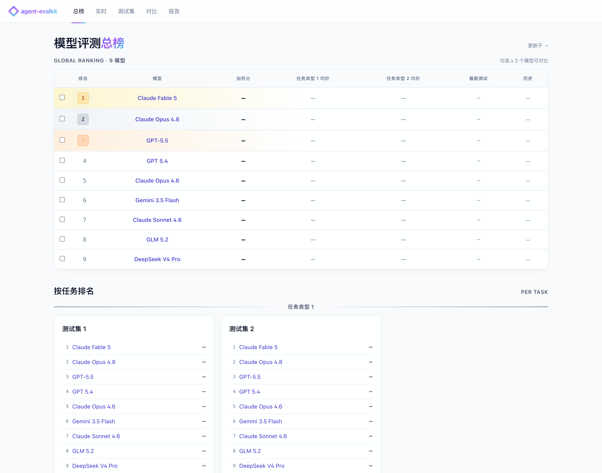
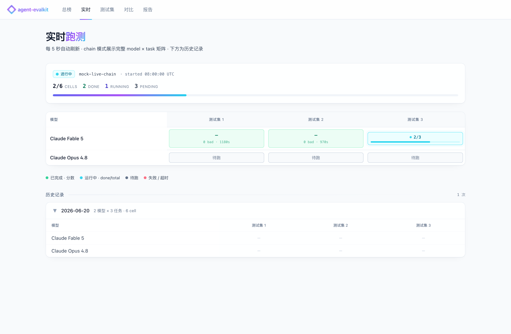
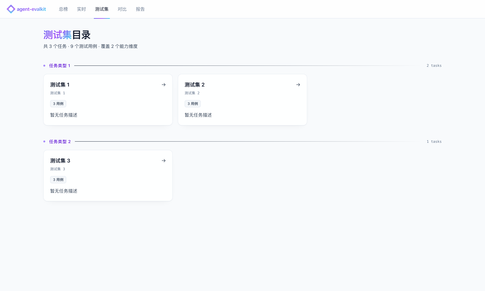
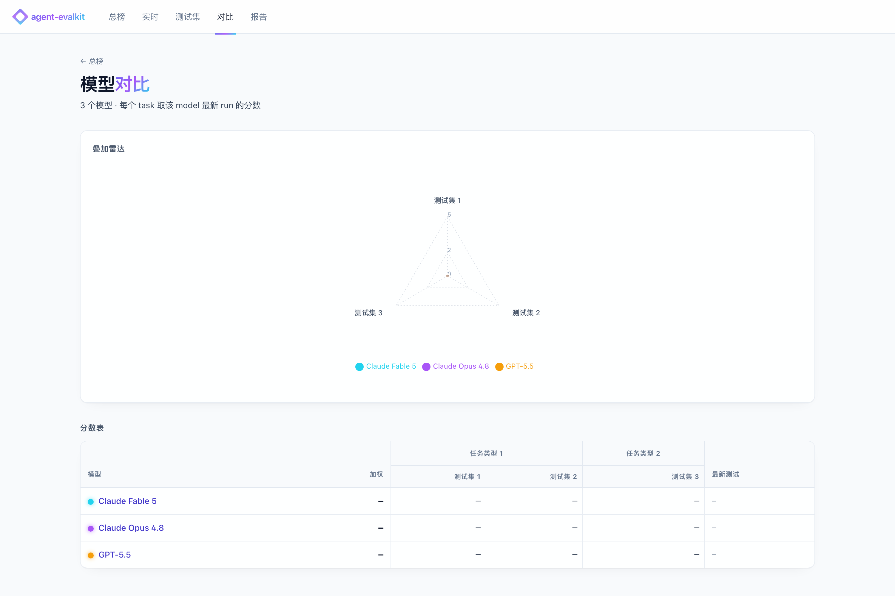
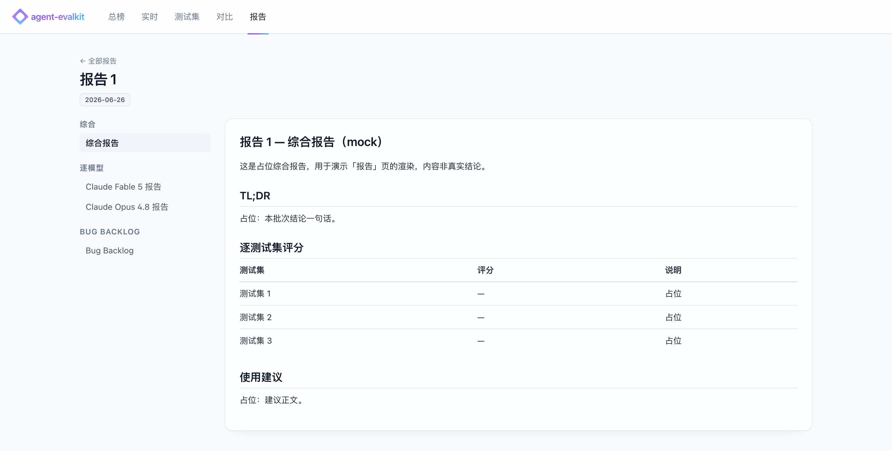
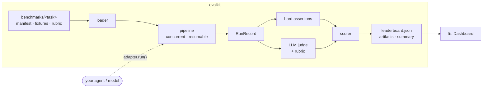

<div align="center">

# 🧪 agent-evalkit

**An open-source evaluation framework + dashboard for AI agents that produce files and call tools.**

Define a test set → run your agent → let an LLM-as-judge score each case against a rubric → read it all on a leaderboard.

[](LICENSE)


</div>

---

A plain string-match test tells you nothing about an agent whose real answer is a generated spreadsheet, a multi-step tool trace, or a paragraph of reasoning. **agent-evalkit** evaluates exactly those: you write **one adapter** (`async def run(...) -> RunRecord`), and the framework handles loading test sets, running them concurrently, judging each result against a rubric, scoring, and surfacing everything on a dashboard.

<p align="center">
  
</p>

> **Note** — the screenshots show the bundled **demo dataset, which is fully synthetic**: real public model names, but blank (`—`) scores and placeholder test sets / reports. Regenerate it any time with `python demo/generate_demo_data.py`, or replace it with your own results.

## ✨ Why agent-evalkit

- **One pluggable seam.** The framework only ever reads a `RunRecord`. Whether the result came from an OpenAI call, your local agent, or a remote product API is the adapter's business — not the framework's.
- **Judge what actually matters.** LLM-as-judge against a per-task rubric, with the agent's response, tool trace, and generated files in view — not regex on a string.
- **A dashboard, file-driven.** Leaderboard, live runs, test sets, model compare, and reports. One env var, no database. Ships a **static fallback** so it deploys with zero backend.
- **Bring your own everything.** Your agent (adapter), your test sets (a folder of YAML + JSONL), your judge backend (any OpenAI-compatible endpoint).
- **Self-host friendly.** MIT licensed, runs locally, deploys anywhere. No vendor, no telemetry.

## 🖥️ The dashboard

Five views, all rendered from the engine's output files (here, the synthetic demo):

<table>
  <tr>
    <td width="50%"><strong>实时 · Live runs</strong><br/></td>
    <td width="50%"><strong>测试集 · Test sets</strong><br/></td>
  </tr>
  <tr>
    <td width="50%"><strong>对比 · Compare</strong><br/></td>
    <td width="50%"><strong>报告 · Reports</strong><br/></td>
  </tr>
</table>

## 🔄 How it works



Only the adapter step is system-specific. Everything else — loading, judging, scoring, the leaderboard — is reused as-is.

## 🚀 Quickstart

### 1. Run an eval (CLI)

```bash
pip install -e .          # installs the `evalkit` command + deps

# Smoke-test the whole loop offline — no API key needed:
evalkit run --adapter mock --no-judge --model mock-model
evalkit leaderboard

# Real run against any OpenAI-compatible endpoint:
export OPENAI_API_KEY=sk-...
evalkit plan --model gpt-4o-mini      # list what would run, no calls
evalkit run  --model gpt-4o-mini      # run + judge + score
```

Outputs land under the data root (`--root` or `$EVALKIT_DASHBOARD_ROOT`, default `.`) in exactly the layout the dashboard reads: `benchmarks/leaderboard.json`, `artifacts/benchmarks/<run_id>/…`, `reports/<run_id>/summary.json`.

### 2. See it on the dashboard

```bash
cd dashboard/frontend
pnpm install
pnpm dev                  # http://localhost:3001
```

With no backend running, the dashboard serves the bundled static demo. To show *your* run, either copy your output files into `public/data/`, or run the backend (below).

## 🧩 Write an adapter

The only thing you implement. Take a fixture, return a `RunRecord`:

```python
# mypkg/my_adapter.py
from evalkit.record import RunRecord

class MyAdapter:
    async def run(self, manifest, fixture, model_id) -> RunRecord:
        result = await my_agent(fixture.prompt, files=fixture.files)
        return RunRecord(request_id=fixture.id, response_text=result.text)
        # also fill tool_results / generated_files for tool- and file-tasks
```

```bash
evalkit run --adapter mypkg.my_adapter:MyAdapter --model my-agent
```

Built-in reference adapters: **`openai_chat`** (any OpenAI-compatible endpoint) and **`mock`** (offline smoke test).

## 📚 Add a test set

A task is a folder under `benchmarks/<name>/`:

```
manifest.yaml    metadata + runtime + scoring + assertions + judge config
fixtures.jsonl   one JSON object per line — the test cases
rubric.md        scoring guide injected into the judge prompt
files/           optional attachments referenced by fixtures[*].files
```

See [`benchmarks/example_qa/`](benchmarks/example_qa/) for a runnable example.

## 🌐 Deploy your own

**Static (no backend)** — best for a public, read-only dashboard:

```bash
cd dashboard/frontend && pnpm install && pnpm build   # → out/
npx serve out                                          # or any static host
```

**Live backend** — serve your own evaluation artifacts:

```bash
pip install -r dashboard/backend/requirements.txt
EVALKIT_DASHBOARD_ROOT=/path/to/eval-data \
  uvicorn dashboard.backend.routes:build_app --factory --port 8000
# then run the frontend in dev mode; it auto-detects the backend
```

Auth is **off by default** (anonymous read-only). To gate a private deploy, set `DASHBOARD_GOOGLE_CLIENT_ID` + `DASHBOARD_JWT_SECRET` (optional `DASHBOARD_ALLOWED_DOMAINS` / `DASHBOARD_ALLOWED_EMAILS`).

## 🗂️ Project layout

```
agent-evalkit/
├─ evalkit/        engine: loader · judge · scorer · leaderboard · pipeline · CLI
├─ adapters/       openai_chat (reference) · mock (offline)
├─ benchmarks/     your test sets — one folder per task (example_qa included)
├─ dashboard/      Next.js frontend + FastAPI backend (file-driven)
├─ demo/           synthetic demo-data generator
└─ DESIGN.md       architecture deep-dive
```

## 📄 License

[MIT](LICENSE).
